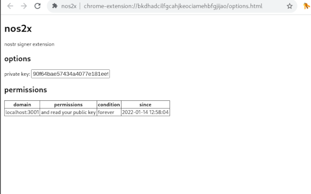
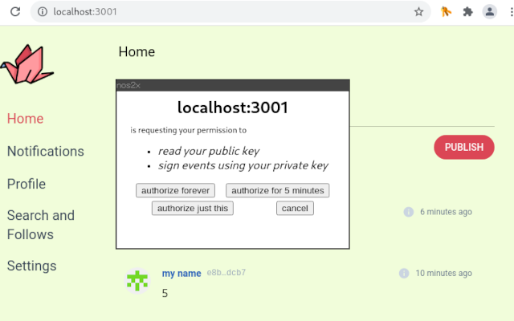

# nos2x

### notes and other stuff signed by an extension

## Nostr Signer Extension

This allows you to sign [Nostr](https://github.com/fiatjaf/nostr) events on web-apps without having to give them your keys.

It provides a `window.nostr` object which has the following methods:

```
async window.nostr.getPublicKey(): string // returns your public key as hex
async window.nostr.signEvent(event): Event // returns the full event object signed
async window.nostr.getRelays(): { [url: string]: RelayPolicy } // returns a map of relays
async window.nostr.nip04.encrypt(pubkey, plaintext): string // returns ciphertext+iv as specified in nip04
async window.nostr.nip04.decrypt(pubkey, ciphertext): string // takes ciphertext+iv as specified in nip04
```

## Demo Video

https://user-images.githubusercontent.com/1653275/149637382-65d50a85-fe30-4259-b7de-99c88b089b53.mp4

## Install

- [Chrome Extension](https://chrome.google.com/webstore/detail/nos2x/kpgefcfmnafjgpblomihpgmejjdanjjp)

## Develop

To run the plugin from this code:

```
git clone https://github.com/fiatjaf/nos2x
cd nos2x
yarn
yarn run build
```

then

1. go to `chrome://extensions`;
2. ensure "developer mode" is enabled on the top right;
3. click on "Load unpackaged";
4. select the `extension/` folder of this repository.

## Screenshots






---

LICENSE: public domain.

Icon made by <a href="https://www.freepik.com" title="Freepik">Freepik</a> from <a href="https://www.flaticon.com/" title="Flaticon">www.flaticon.com</a>.
