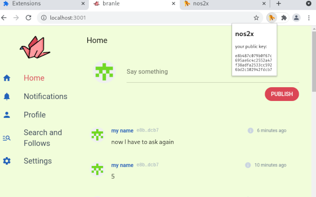
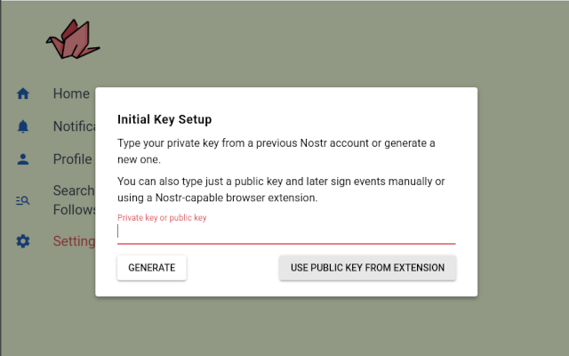
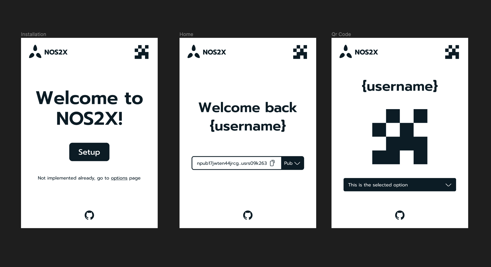
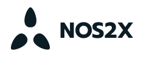

# nos2x
### notes and other stuff signed by an extension

## Nostr Signer Extension

This allows you to sign [Nostr](https://github.com/fiatjaf/nostr) events on web-apps without having to give them your keys.

It provides a `window.nostr` object which has the following methods:

```
async window.nostr.getPublicKey(): string // returns your public key as hex
async window.nostr.signEvent(event): Event // returns the full event object signed
async window.nostr.getRelays(): { [url: string]: RelayPolicy } // returns a map of relays
async window.nostr.nip04.encrypt(pubkey, plaintext): string // returns ciphertext+iv as specified in nip04
async window.nostr.nip04.decrypt(pubkey, ciphertext): string // takes ciphertext+iv as specified in nip04
```

## Demo Video

https://user-images.githubusercontent.com/1653275/149637382-65d50a85-fe30-4259-b7de-99c88b089b53.mp4

## Install

* [Firefox Add-on](https://addons.mozilla.org/en-US/firefox/addon/nos2x/)
* [Chrome Extension](https://chrome.google.com/webstore/detail/nos2x/kpgefcfmnafjgpblomihpgmejjdanjjp)

## Develop

To run the plugin from this code:

```
git clone https://github.com/fiatjaf/nos2x
cd nos2x
git checkout chromium                       # or git checkout firefox
yarn                                        # or use npm or pnpm
yarn run build
```

then ...

* Chromium:
  1. go to chrome://extensions
  2. make sure, "developer mode" is enabled on the top right
  3. "Load unpackaged"
  4. select the `extension/` folder
* Firefox:
  1. go to about:debugging
  2. "This Firefox"
  3. "Load Temporary Add-on..."
  4. select any file from the `extension/` folder

## Screenshots






## ReDesign



### Font

[Prompt](https://fonts.google.com/specimen/Prompt?preview.text=NOS2X&preview.size=48&preview.text_type=custom&query=Prompt&category=Sans+Serif&subset=latin&noto.script=Latn)

### Logo

### Logotype

### Svg


Figma file: [https://www.figma.com](https://www.figma.com/file/04tjsv8qfWV6eeew73qbaX/Nos2x?node-id=2%3A141&t=gZQRRpXb5VRp3hpJ-1)

---

LICENSE: public domain.